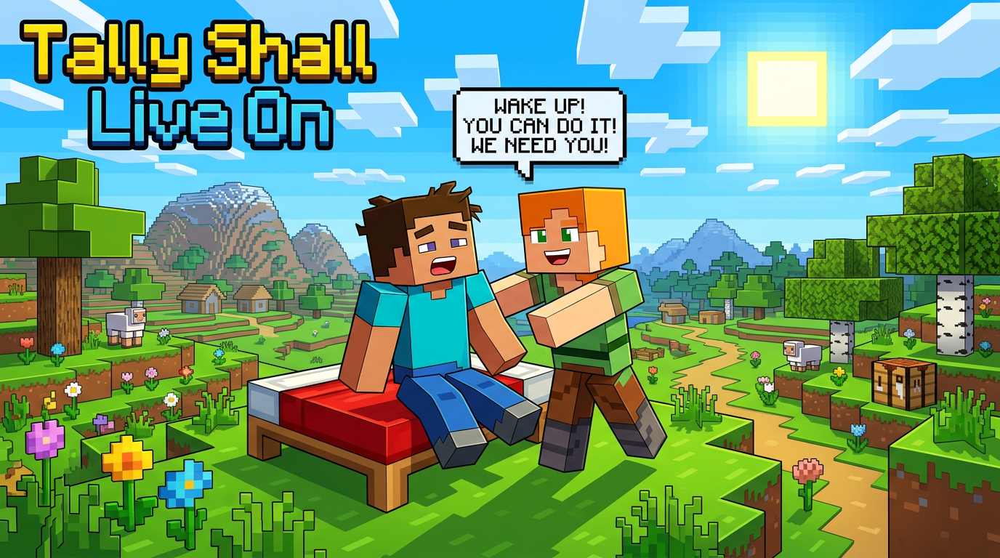

# Tally Shall Live On: Preparing for the Worst, Hoping for the Best

We are saddened by the recent news indicating that Tally.xyz may be shutting down. The platform has been a cornerstone for DAO governance, providing an intuitive, reliable, and deeply integrated interface that countless communities depend on to manage their protocols and treasuries. 

We are actively reaching out to the Tally team and founder Dennison to see if there is anything we can do to help keep Tally alive. The value they've created for the ecosystem is immense, and we sincerely hope this isn't the end of their journey.

However, we understand that sometimes circumstances are irreversible. Our industry needs to brace for the potential reality of a post-Tally ecosystem, and we must ensure that the DAOs relying on these tools are not left stranded without a way to govern themselves.

## TSLO (Tally Shall Live On): A Self-Hosted First Solution

To prepare for this possibility, we have rapidly developed and open-sourced **TSLO (Tally Shall Live On)**—a "self-hosted first" open-source project designed to support DAOs that might run into challenges if their primary interface goes offline.

You can view a live experimental deployment here: **[https://labs-tslo.vercel.app/](https://labs-tslo.vercel.app/)**

The source code is fully open and available here: **[github.com/d3servelabs/labs-tslo](https://github.com/d3servelabs/labs-tslo)**

## The Power of CROPS: Why This Works

In our experiments, we were able to successfully use the ENS DAO as a target. The reason this was possible—and the reason DAOs should not panic—comes down to a fundamental principle of Web3 architecture: **CROPS (Censorship Resistant Open Protocol Standards)**.

Because Tally built their platform the right way—interfacing with onchain governor contracts rather than relying on a proprietary offchain database—most of the critical data is already onchain. The proposals, the votes, the execution logic, the timelocks—it all lives on Ethereum (and its L2s).

This means that with a new client, that data remains entirely readable and functional. TSLO simply acts as a new lens to view and interact with the immutable governance data that already belongs to the community.

## A Tribute, Not a Competitor

We want to be incredibly clear: **this is by no means an attempt to build a Tally competitor**. Instead, it is a way for us to call for Tally to stay. We believe this industry desperately needs great projects like Tally. Our cyberpunk movement needs governance tools like Tally now more than ever.

I respectfully disagree with Dennison's view that "the market isn't here" and that "crypto finds its PMF in payments and speculation." My view is that we are on the absolute dawn of mass adoption. I also respectfully disagree that "regulation clarification makes DAOs optional." Instead, I've always seen it simply: a company *is* a DAO, and a DAO is just a company with better governance tools, transparency, and trust.

Tally plays a crucial role in making that trust visible and actionable. Here is our tribute to that mission.

## What's Next?

Our current implementation is a fast-tracked MVP. It includes:
- DAO landing pages with full proposal history
- Proposal details with vote tallies and calldata
- A minimal read API for DAO and proposal data
- A "sync-from-chain" mechanism that doesn't rely on centralized indexers

We are still building out the write-paths (voting and proposal creation), but the foundation is there. 

If your DAO relies on Tally, we encourage you to explore TSLO. Fork the repository, point it at your governor contracts, and deploy your own resilient, self-hosted governance interface. 

We stand with the Tally team, but we also stand ready to support the DAOs that need a fallback. Let's ensure that, no matter what happens, governance continuity remains unbroken.
